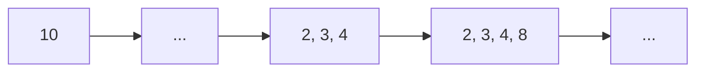
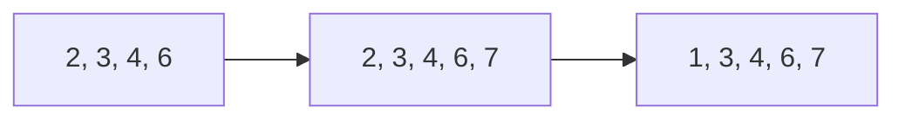

In this LeetCode question, we are given an integer array `nums`. Our job is to find the _length_ of the longest
increasing subsequence of this array. <!--truncate-->

First, let's define what a subsequence is. Consider an example array `nums = [0, 1, 0, 4, 2, 5]`. Here are examples of
valid subsequences of `nums`:

```text
0, 4, 5
1, 4, 2
0, 0, 2, 5
...
```

Note that we can obtain each subsequence by deleting some elements from `nums` without changing the order. For example,
`0, 2, 4` is not a valid subsequence since `4` appears before `2` in the original array.

## Dynamic Programming Intuition

This problem is a well-known dynamic programming problem. However, it might not be intuitive to detect this initially.
When it comes to dynamic programming, we should first think of the _subproblems_.

### Subproblems

Suppose we want to find the longest increasing subsequence of the array `nums[0..i]`. We can first find the answer for
`nums[0..i-1]` and then add `nums[i]` to the answer in some way.

Now, assume that we know the answer for the array `nums[0..j]` for all `0 <= j <= i - 1`. How can we use these answers
to construct the solution for `nums[0..i]`?

Let `dp[i]` denote the length of the longest increasing subsequence ending at index `i`. From the above observations, we
can see that when reaching a new value `nums[i]`, we need to check which increasing subsequence(s) it can extend.

### Recurrence Relation

We can look through all `j` where `0 <= j <= i - 1`, and if `nums[i] > nums[j]`, it means that we can append `nums[i]`
to the subsequence ending at `j` with length `dp[j]` to form a longer subsequence. Otherwise, we can start a new
subsequence at `i` with length 1.

With these observations, we can form the recurrence relation:

$dp[i] = \max\left(1, \max_{\substack{0 \leq j \leq i-1 \\ nums[j] < nums[i]}} (dp[j] + 1)\right)$

Next, we need to define the base cases. In fact, we can first initialise all the elements in `dp` to be `1`, since each
element forms a subsequence of length 1 by itself. The value `dp[0]` is well-defined, since it represents the longest
increasing subsequence ending at the first element.

### Time Complexity

At the end, we can get the answer by taking the maximum value in the `dp` array. The time complexity for this solution
is $O(n^2)$ since in each iteration, we iterate through all previous elements to find the maximum, resulting in two
nested loops.

## Optimising With Binary Search

Although the above solution is quite efficient (we even achieve $O(n)$ space), we can actually get a better time
complexity of $O(n\log n)$ with a _not really dynamic programming_ approach. Although we can still view this as
subproblems, I would say we are not really storing the answer directly.

### Background

Here is the intuition. Take a look at this array example `nums = [10, 9, 2, 3, 4, 8, 6, 7, 1]`. Let's say we want to
keep track of all increasing subsequences and then we can later find which one yields the maximum length. As we iterate
through this array to index `5`, i.e., the element `nums[5]` is `8`. Here is the list of subsequences we have:

```text
2, 3, 4, 8
```

Note that I don't include subsequences such as `3, 4, 8` here to be a bit more efficient by only starting a new sequence
if we find a new smallest element. Since we can always append `3` to `2` to get a longer subsequence, there is no point
in starting fresh from `3`.

Let's continue to finish the entire array. Here are the suitable subsequences we have:

```text
2, 3, 4, 8
2, 3, 4, 6, 7
1
```

Now, it is true that the answer to this example is 5. Observe that we don't really need the actual subsequence for this
problem, since we are only interested in the length.

### Forming and Validating Solution

Let's say we have a temporary array `temp` that has the exact same length as the longest increasing subsequence found so
far, but the values in the array don't really need to represent a valid subsequence. The following diagram represents
the state of this array as we iterate through `nums`.



Now, we reach an element `6`. What should we do? We know that we can actually add it after the element `4` and still get
the same length. What if we replace `8` with `6`? We can continue with:



Observe the interesting thing we did in the last step. As demonstrated before, we would normally start fresh by starting
a subsequence with the element `1`. However, we replace the first element _not less than 1_, which is `2`, instead. The
array we have is not a valid increasing subsequence anymore, but the length is still correct.

The intuition is that if we were to have a longer array and then the actual longest subsequence starts at the element
`1`, those elements in the list will be replaced as we fill it with a longer one! We only append in the case that there
is an element greater than all elements in our temporary array. So the length of this temporary array is still correct.

### Implementation

In simple words, we know that there are some subsequences that bring us to this length, even though we have already
forgotten what the starting point of that subsequence is. We can utilise binary search in the process of finding the
_first element not less than $x$_, where $x$ is the current element.

Here is an example implementation in C++ using `std::lower_bound` to avoid implementing binary search ourselves:

```cpp
#include <vector>
#include <algorithm>
using namespace std;

int lengthOfLIS(vector<int>& nums) {
    vector<int> temp;

    for (int num : nums) {
        auto it = lower_bound(temp.begin(), temp.end(), num);
        // We have something to replace
        if (it != temp.end()) { 
            *it = num;
        } else {
            temp.push_back(num);
        }
    }

    return temp.size();
}
```

Using this approach, we have solved this problem in the optimal time complexity of $O(n\log n)$. If I remember
correctly, there is another way of solving this in the same time complexity (possibly with a larger constant factor)
through the use of some advanced data structures. However, I think it is too complex for typical coding interviews.