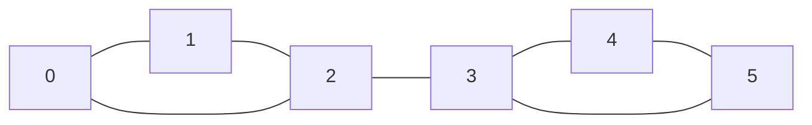
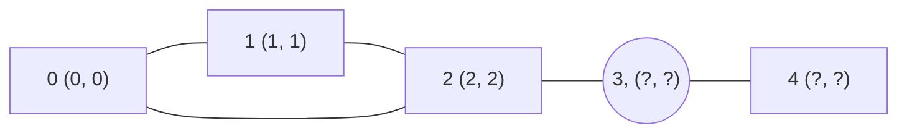
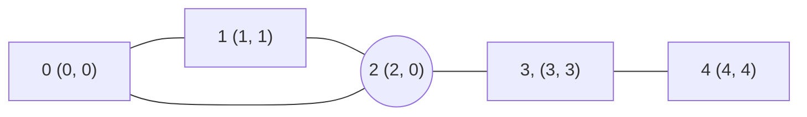
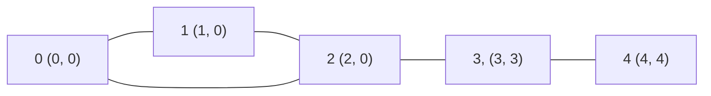

Consider a network of servers represented by a graph $(V, E)$ where $e=\{u,v\}\in E$ if and only if there is a direct
connection between server $u$ and $v$. Some servers are connected indirectly through intermediate nodes, i.e., there
exists a [path](https://en.wikipedia.org/wiki/Path_(graph_theory)) between them. This problem considers the *critical
edges* where removing them destroys the connections between the servers. <!--truncate-->

## Reformulating the Problem

First, let's reformulate the problem. In graph theory, there is actually a definition of special edges called *bridges*,
which represent the edges that, when removed, will increase the number of connected components in the graph.

In this problem, we are given that all servers are connected initially, so the number of connected components is one. In
fact, we are interested in finding the bridges in the graph, since removing a bridge will make the number of connected
components become two.

## Tarjan's Algorithm

There is a well-known algorithm to find bridges in the graph, known as *Tarjan's Algorithm*. This section will explore
the intuition behind it, since implementing it basically means we have already solved the problem.

### Extending Depth-First Search

The key idea of this algorithm is to extend *Depth-First Search (DFS)*. Suppose we run a DFS from any node $u$ in the
graph. Let's say we usually start with the node indexed at 0, since it is easier to code and reason about.

Normally, DFS will traverse all paths until the node doesn't have any unvisited neighbours. That is when we start to go
back to the node's parent and then explore other neighbours of the parent.

We now first introduce an array $T$ which represents the time when each node is visited during a DFS run. We can either
choose $T[0]$ to be 0 or 1; it doesn't matter as long as the ordering is correct. Intuitively, this array helps us
determine the order in which nodes are visited, but that's not enough for this problem.

Before we go further, I want to address some possible misconceptions that would oversimplify the problem statements by a
lot. Initially, I was thinking that we could just check if the degree of the node is 1, since there would be no way we
could connect to it if the edge is removed.

:::danger
The above explanation won't work, since it is possible that we will miss some bridges. The idea of connected components
suggests that a node with degree greater than two might be part of another component, as shown in the graph below.



Here, $\{2,3\}$ is a bridge, but neither node has a degree of 1.
:::

As we can see here, there is no way to reach node 3 from node 0 without the edge $\{2,3\}$. Interestingly, we know that
if we start from node 0, we will reach node 3 before nodes 4 and 5. This observation inspires us to introduce a new
array $L$, where each element in the array represents the *lowest visited time* of the nodes that are neighbours of the
node we are visiting, excluding the direct parent.

:::note
We don't include the direct parent because otherwise every node will have this value as 0, which doesn't convey any
meaningful information.
:::

Now, we always initialise the value of $L$ for each node to be the same as the time we visited it. Obviously, this value
can only be changed if somehow there are alternative paths to reach the node again (not through parents).

### Why Does It Matter?

To see this in action, let's consider the simpler version of the above graph, and suppose our DFS always visits the node
with the lowest index first.



Note that the numbers in the brackets of node $i$ represent the current values of $T[i]$ and $L[i]$ respectively.
Suppose we are currently looking at node 3 (that's why it is in circular shape). The current call stack in DFS
is $[0, 1, 2, 3]$.

Now, after we visit nodes 3 and 4, we can see that node 4 doesn't have any unvisited neighbours. So we are done with it
and we keep traversing back, i.e., popping the stack, until we are at node 2.

So far we didn't update any value of $L$ since we don't have any non-parent neighbours of the node to compare the value
with. But now, although node 1 is the parent of node 2, node 0 is not the direct parent of node 2. Following the rule,
we will update $L[2]$ to be $\min\{L[0],L[2]\}=0$.



Now, as we go back to node 1, we have node 2 that satisfies the condition, so we can update $L[1]$
as $\min\{L[1], L[2]\}=0$. Note that when coming back to nodes like node 3, we also check for the
minimum of $L[3]$ and $L[4]$, but that doesn't change the value. This is our final graph:



### Interpreting the Results

Great! We have extended DFS, but how does this support our original task? Since DFS traverses the nodes in order, this
process is pretty much the same as checking if we can go back to any previous nodes without using the parent!

Every node $i$ that shares the same value of $L[i]$ can be reached in some way without using the same path we found in
DFS. However, when two nodes do not share the same $L[i]$, we can see that if $L[j] > T[i]$ where $i$ is the parent
of $j$, there is no way node $j$ can reach the lower time without going through node $i$ (its parent). Therefore, the
edge $\{i,j\}$ is a bridge!

In our example, we know that there are two edges that follow this case, namely $\{2, 3\}$ and $\{3, 4\}$. Using this
approach, we have successfully understood the idea behind *Tarjan's Algorithm*.

### Implementation

Below is the C++ implementation of the algorithm:

```cpp
#include <vector>
using namespace std;

vector<int> time, low;
vector<vector<int>> adj;
vector<vector<int>> bridges;
int timeCounter = 0;

void dfs(int node, int parent) {
    time[node] = low[node] = timeCounter++;

    for (int neighbour : adj[node]) {
        if (neighbour == parent) continue;
        if (time[neighbour] == -1) dfs(neighbour, node);
        if (low[neighbour] > time[node]) bridges.push_back({node, neighbour});
        low[node] = min(low[node], low[neighbour]);
    }
}
```

Since this is a DFS algorithm, the time complexity is $O(|V|+|E|)$. Below is how we call it to get the complete
solution:

```cpp
vector<vector<int>> criticalConnections(
    int n, vector<vector<int>>& connections
) {
    adj.assign(n, {});
    for (auto &c : connections) {
        adj[c[0]].push_back(c[1]);
        adj[c[1]].push_back(c[0]);
    }

    time.assign(n, -1);
    low.assign(n, -1);

    for (int i = 0; i < n; i++) {
        if (time[i] == -1) dfs(i, -1);
    }

    return bridges;
}
```

Note that our approach uses an adjacency list to allow fast access to edges corresponding to each node. We also
initialise unvisited nodes by initialising the time as -1 to avoid having an extra array.