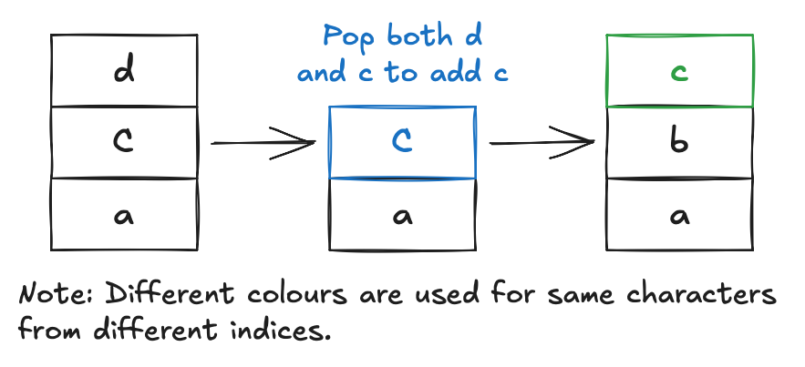
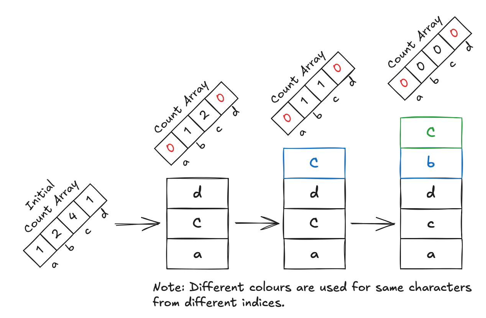
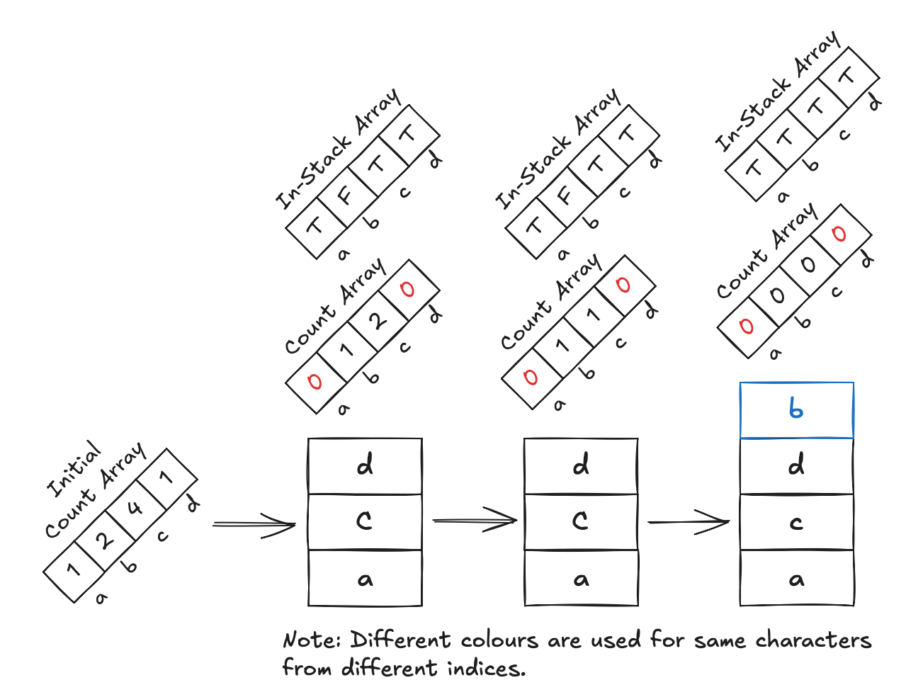

Consider a string of lowercase characters. This problem asks us to remove the duplicate characters from the string and
return the result string that has the _lowest lexicographical order_ among the possible outcomes. Indeed, this problem
is
the same as finding the subsequence of unique characters (that has the lowest lexicographical order). <!--truncate-->

## Intuition

### Greedy Approach

When I first found this problem, I did not recognize it as a stack problem initially. Indeed, we may want to be greedy
about the solution. With that said, the rough idea is to start a string with the lowest possible lexicographical order,
then
add new characters to the string according to the order they appear in the original string.

The problem I found about this approach, which required me to wrap my head around for a while, is that it is possible
that, let's
say we find `a`, and then want to add `b`, but then if `b` appears at the last position in the array, I know that it is
certainly not possible to construct a proper string considering we have `c` and `d`, for example.

Obviously, it requires some sort of backtracking, which makes it much more complicated. However, I went down to see the
tag of the problem denoting _monotonic stack_, and I think there could be a way of doing something about it.

### Monotonic Stack

First, let's make sense of the idea of monotonic stack. It is as simple as its name suggests. We maintain a stack where
the
elements in the stack are either (strictly) increasing or decreasing. The setup depends on the problem, but this similar
invariant will remain.

To maintain the ordering, we make sure to repeatedly pop elements out of the stack as we iterate through the original
array and only add new elements to the top when we can safely do so. While we are doing this process, we also do some
other
work related to the problem.

Let's take a look at the example string `"cbacdcbc"`. If we were to process it using a monotonic increasing stack
without
worrying about anything else:

First, we can add `c` to the stack since it is empty. Then we find `b`, and `b` is smaller than `c`, so instead we pop
`c` out and put `b` in. Following that, we find `a`, which is also smaller than `b`, so we pop `b` and put `a` in. Below
is
the illustration of the entire process after adding `a`.



Well, now we are close to the work, but the approach is incorrect since it obviously gives an incorrect answer. In this
example, we know that there is only one `d` in the string. If we were to pop it because we find a new lexicographically
smaller character, this would not work out.

To fix this, we introduce an array that maintains the overall counter of the characters in the string. As we go through
the array, we decrease the counter of that element. If at any point the counter becomes 0, we know we should not pop
that element, since we will not be able to add it back in the future.



Now we get something close to the answer, but you can see that we end up adding an extra `c` at the end. This is because
`c` is greater than `b`, so nothing is wrong with that logic. We also didn't pop anything. The fix to this is simple; we
just need to introduce another array that keeps track of the elements in the stack, i.e., whether the character already
exists. We skip processing that element if it is already in.



Notice how we avoid processing the second `c` after `d` since we now keep track of valid elements.

## Implementation

Below is the C++ implementation of the code. Notice how we process each element exactly once, which is efficient. The
brute force solution may involve starting at any index and checking if the string proceeding it could form a valid
solution or not. We may need to check later for all strings to find the smallest.

```cpp
#include <stack>
#include <string>
#include <sstream>
#include <algorithm>
using namespace std;

string removeDuplicateLetters(string s) {
    int counter[26];
    bool inStack[26];
    stack<char> st;

    for (auto& c : s) counter[c - 'a']++;

    for (auto& c : s) {
        counter[c - 'a']--;

        if (inStack[c - 'a']) continue;

        while (!st.empty() && st.top() > c) {
            char top = st.top();
            if (counter[top - 'a'] == 0) break;
            st.pop();
            inStack[top - 'a'] = false;
        }

        st.push(c);
        inStack[c - 'a'] = true;
    }

    stringstream ss;
    while (!st.empty()) {
        ss << st.top(); st.pop();
    }

    string ans = ss.str();
    reverse(ans.begin(), ans.end());
    return ans;
}
```

The time complexity for this solution is $O(n)$. I think this is the first problem I work with that is about monotonic
stack as well. Stay tuned for the next problems with solutions coming along!