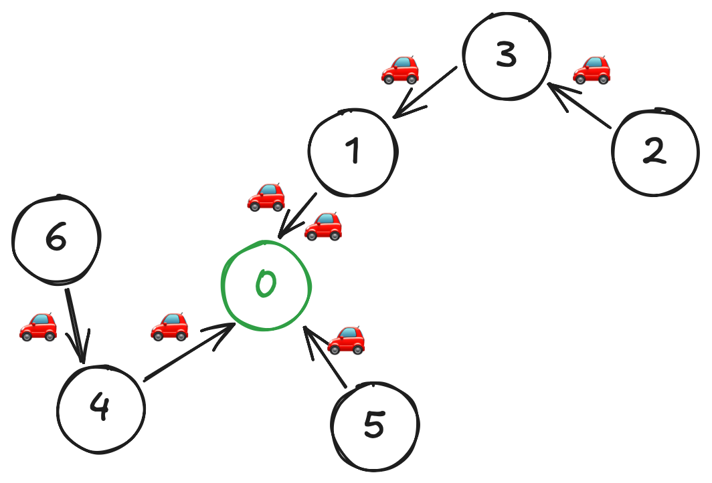

In this problem, we are given a tree structure of a city plan. By that, it means that we have a graph of $n$ nodes that
consists of exactly $n-1$ edges. The graph is also connected, i.e., it is possible to travel from one city to any other
one. The setting is that the capital city is marked at node `0`, and every other city has one representative that needs
to come to the capital. They can travel together in a car, which has a limited number of seats. The problem asks us to
find the minimum number of fuels used, considering that moving from one to another city takes exactly 1 liter of
fuel. <!--truncate-->

## Intuition

This problem can seem daunting at first, but take a look at the below example to understand what we are trying to do.



### Walkthrough

In this example, we only allow two passengers per car; the fuel required is exactly 7 liters. Observe that, since each
edge requires 1 liter of fuel, we can think of the problem as counting how many cars it takes to pass that edge. The
optimal solution requires us to be greedy and try to maximize the number of passengers in each car. Doing this will
minimize the number of cars that need to pass through each edge, which in turn minimizes the fuel cost.

So now, we kind of have a rough idea that in each travel on the edge, if we know the number of cars required, we will be
able to accumulate answers upon that. Now, how do we determine the number of cars required?

In the above example, traveling from city 2 to 3 requires 1 car since there is 1 passenger traveling from 2 to 3. When
traveling from 3 to 1, we have 2 passengers, and we can fit them in 1 car. However, after we pick up the passenger from
1, we now have 3 passengers, and since we can only fit 2 in a car, we will need 2 cars to travel from 1 to 0.

### Mathematical Formulation

So, think of it this way: we know that the number of passengers on each node is always 1. If we can count the total
passengers from all previous nodes, the total passengers will be 1 (the node itself) + the sum of passengers from all
its children nodes.

Once we have that, we can easily calculate the number of cars required to travel from that node to
its parent by calculating $$\displaystyle\lceil\frac{\text{total passengers}}{\text{seats}}\rceil.$$

## Implementation

### Depth-First Search (DFS)

First, let's consider a helper DFS function that will return the total number of passengers from that node
to all its children nodes.

```cpp
#include <vector>
using namespace std;

int dfs(int node, int parent, int seats, long long& fuels, vector<vector<int>>& adj) {
    int passengers = 1; 
    for (int& nbr : adj[node]) { 
        if (nbr == parent) continue; // Avoid going back to parent
        int sub = dfs(nbr, node, seats, fuels, adj);
        passengers += sub;
        fuels += (sub + seats - 1) / seats; // Ceiling
    }
    return passengers;
};
```

Here, we denote `adj` as the adjacency list of the graph. Since this is recursion, the computation is done from
bottom-up; it means that the deepest node is processed first, then we accumulate the total passengers upon. The node we
will specify when calling this initially is `0`, the capital city. We can set the parent of that node to be -1, since it
doesn't have a parent.

:::tip
In other languages, you may use the ceiling function directly, but in C++, we can use the trick of adding `seats - 1`
before.
:::

### Final Code

Below is the final code that uses the above helper function to compute the final answer.

```cpp
long long minimumFuelCost(vector<vector<int>>& roads, int seats) {
    int n = roads.size() + 1;
    vector<vector<int>> adj(n);
    for (auto& r : roads) {
        adj[r[0]].push_back(r[1]);
        adj[r[1]].push_back(r[0]);
    }
    
    long long fuels = 0;
    dfs(0, -1, seats, fuels, adj);
    return fuels;
}
```

Notice how we first build an adjacency list from the given edges. This is a standard practice to save space and allow
fast access to the neighbors of each node.

We also pass a reference to the `fuels` variable to the DFS function, so that we can accumulate the answer as we go
through each node. We may need an extra function if we are not allowed to use a reference. The time complexity of this
solution is $O(n)$, since we only visit each node once.