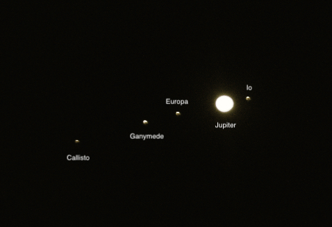
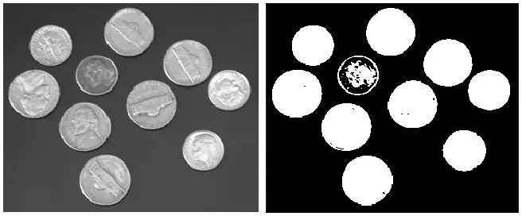
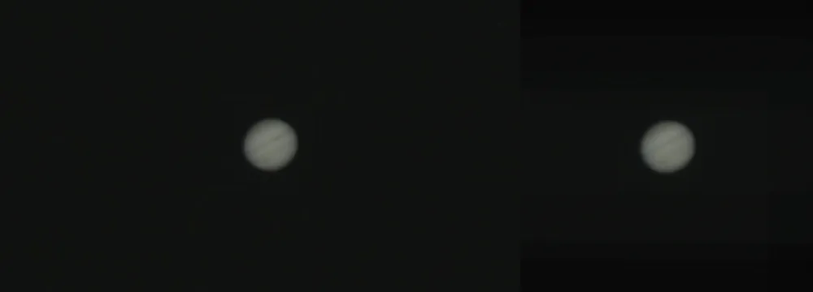

In this project, I built a C++ program that can process video footage of planets moving through a telescope and then
auto-detect the planet, crop to the region of interest (ROI), align them to the selected template, and stack
them to provide a better signal-to-noise ratio.

This is a standard technique in *astrophotography*, but doing this with the help of more fundamental libraries like
*OpenCV* and *OpenMP* has taught me a lot about how we represent and process image data efficiently in the modern
computer. <!--truncate-->

## Lucky Imaging

First of all, I would like to introduce readers to the technique we use in *astrophotography* to provide a clearer
context, along with the choices we will make later in the project and why they work under certain assumptions.

Normally, nighttime photography (where *astrophotography* generally takes place) is quite difficult since we do not
have much light. Although there are many photography techniques out there to help mitigate this challenge, we
generally face a problem with *noise*.

### Underlying Mathematics

This is also the case when we capture photos with a telescope, you can think of it as a lens with a very high
zoom factor. Still, the light from planets or celestial objects coming from hundreds of millions of kilometers away
is very subtle. Ideally, the signal in terms of the number of photons that fall on the camera sensor follows the
[*Poisson Distribution*](https://en.wikipedia.org/wiki/Poisson_distribution), and this is where statistics come in.

Roughly speaking, the camera interprets the value in each pixel as the amount of photons, or the signal, that is
arriving.
You can view each capture of the same photo as a representation of the *mean* of the actual pixel value that each
pixel should have.

Recall from statistics class that with more and more samples, you can predict the mean with
greater confidence. Night photography contains a lot of noise, which is roughly represented by the *standard deviation*
of the *Poisson Distribution*.

In daytime photography, we already have less noise, meaning the mean value we are trying to predict is *already accurate
(low standard error)*. However, at night this is not the case, which is why we capture multiple images. By stacking
them together and finding the *mean or median of each pixel*, the resulting image is noticeably less noisy.

### Planetary Photography

Generally, nighttime photography involves opening the camera sensor for a longer time to gather more light. Since
multiple photos are needed for stacking, this might even take hours of photography to get a single image.

However, this is not the case for planets. First, because the telescope already helps us gather light, if we keep the
sensor
open for too long, we end up with a bright circle with no details. On the other hand, shorter exposure allows us to
capture more detail in the planet itself, though with less background detail such as Jupiter’s moons.

<figure>

<figcaption>When opening the camera sensor for too long, we can image subtle objects like Jupiter's moons, but we will lose details on Jupiter's surface. _Image credit: https://skyandtelescope.org/online-gallery/moons-of-jupiter-annotated/_</figcaption>
</figure>

Therefore,
we usually go with lower exposure, similar to everyday photography. To gather as many frames as possible for stacking,
we can film a video of planets moving across the field.

:::warning
The important caveat here is that you cannot simply get millions of images by filming for an hour and hope you will get
better results, since planets do rotate around themselves.

_Photos captured over too broad a period will be blurry when
stacked, like when you move your hand quickly in front of a camera._
:::

If done correctly, this technique is called *lucky imaging*, you capture multiple instances of the same object to
try to *overcome atmospheric turbulence and other factors that generate noise*.

## Video Processing Workflow

Now that we have an overview of what is going on, let's see how we can approach this as a coding problem. Generally, the
workflow should be as follows. This is the approach used in famous software
like [PIPP](https://pipp.software.informer.com/download/) and [AutoStakkert!](https://www.autostakkert.com/).

:::info
The reason I decided to build my own was also because these software packages are not available on macOS. Back in the
day when I was an _astrophile_, I still used Windows, so there was no problem.
:::

This is the flowchart depicting the general workflow of most planetary image processing software. Some cannot perform
every step and require the integration of multiple ones.

```mermaid
flowchart TD
    A[🎥 Input Video] --> B[🖼️ Convert Video to<br/>Array of Images]
    B --> C[✂️ Crop Each Image<br/>Square Centered on Planet]
    C --> D[🔍 Quality Check<br/>Contrast • Sharpness • SNR]
    D --> E[⭐ Select Template Image]
    E --> F[🎯 Subpixel Alignment<br/>Align All Images to Template]
    F --> G[📚 Stack Images]
    G --> H[🌌 Final Processed Image]

    %% Styling for better visual appearance
    classDef inputOutput fill:#e1f5fe,stroke:#01579b,stroke-width:2px,color:#000
    classDef processing fill:#f3e5f5,stroke:#4a148c,stroke-width:2px,color:#000
    classDef qualityCheck fill:#fff3e0,stroke:#e65100,stroke-width:2px,color:#000
    classDef finalResult fill:#e8f5e8,stroke:#1b5e20,stroke-width:2px,color:#000
    
    class A,B inputOutput
    class C,F,G processing
    class D,E qualityCheck
    class H finalResult

```

### Extracting ROI from Videos

In order to figure out the steps required, it is easier to think backward. Generally, stacking only works if we assume
that each pixel corresponds to the same signal that we are trying to capture, so we need to align all images first.

In order for the alignment algorithm to really focus on the object, we first need to identify the ROI, which should
essentially be a square crop around the circular planet with some padding (mainly for aesthetic purposes).

Therefore, our first step is to get that ROI. First, we make sure to process the video as an array of images. Following
that, we detect the ROI in each image and crop around that. Simple, right?

There are several methods for doing so. The one I prefer is to get the binary representation of the image. Yes, only
black and white. Since we have a dark background, it is easy to establish some value in the threshold from 0 to 255
where all parts of the planet are in white, and then the remaining is just the dark background.

<figure>

<figcaption>Example of how images would look like after converting to binary. You can imagine Jupiter being a white circle in the foreground. _Image credit: https://www.dynamsoft.com/blog/insights/image-processing/image-processing-101-color-space-conversion/_</figcaption>
</figure>

:::tip
For extensibility, we use adaptive thresholding instead of absolute values. OpenCV handles this really well, so we don't
really need to worry about it.
:::

Also, don't forget to convert the image to grayscale beforehand since normal images have three color channels. The
grayscale one will be useful for future calculations as well.

### Aligning Images

Now that we have images that are easy to align, let's think about which image we are aligning the rest to. This image
will be referred to as the _template_.

When selecting a template, we can consider a few things. Generally, these are contrast, sharpness, and possibly
signal-to-noise ratio, though that should be quite invariant. Personally, I found sharpness to play the highest factor,
so when calculating the quality score, I weight sharpness the most.

Now that the image is quite aligned already after cropping, we only need to do _subpixel alignment_. That is just a
buzzword; what I mean is to fine-tune the alignment furthermore.

The technique that I decided to use here is called _phase correlation_. First, we perform [_Discrete Fourier
Transformation_](https://en.wikipedia.org/wiki/Discrete_Fourier_transform) on each image.

It is quite well-known that the technique provides us with information on how signals (like sine and cosine waves)
differ from the original, which we then translate accordingly.

### Stacking Images

Perfect! Now we have the images that are ready to be stacked. Are there any other challenges here? Unfortunately yes, we
have something more to consider.

There are some _potential edge cases_ here. What if the image you captured has extra noise that came from an external
source (like a plane passing by)? This simply violates the assumption that the noise follows the Poisson Distribution.
Or more simply, the mean is definitely affected if we have some images that are extremely bright.

To address this issue, we use a technique called _sigma clipping_. We establish some threshold, for example, if the
value in a pixel deviates too much from the mean, i.e., 2 sigma or 3 sigma, we simply _clip_ it.

By clipping, there are several methods of clipping. You may clip that to the _maximum allowed values_ (basically
preventing outliers) or fall back to the median, which is what I do here. The figure below demonstrates how stacking
helps improve the image quality.

<figure>

<figcaption>Having more images can help improve the quality and reduce noise in the images. I never said it only improves image signal; it also reduces background noise, which makes the background darker! These footages were taken around October 2022 back in my home in Thailand.</figcaption>
</figure>

:::info Disclaimer
To get the most details, most images captured are quite small. They may appear noisy here on both sides, but it's
actually just a scaling issue.
:::

Aside from that, the image shown on the right is the result of stacking only 10 images! Generally, we have videos of a
minute long. Multiply by frame rate to see how many images we have.

## Optimizing the Computation

Since this is a coding project after all, I want to share some technical details that I learned along the way and how
they are useful. I found the use of OpenMP to make the process faster by 3.5 times! This is the most successful attempt
at parallel computation I have achieved so far in all my projects.

### What to Parallelize?

When thinking of parallelizing things, I usually think of where things would benefit from doing so. The good starting
point is identifying where we use for loops, which are well-known for performing sequential tasks.

In my program, there are potentials for loops including the image alignment where I go through each image to first
calculate the quality during template selection and when I am shifting the rest of the images to align with my template.

Basically, I can use the following directives (with some specifications on shared resources to do the thing):

```cpp
#pragma openmp parallel for // ...
```

This basically means we are parallelizing over the images (we are processing each image in a different thread). I also
have the array storing all images, so write access to each can cause [_race
condition_](https://en.wikipedia.org/wiki/Race_condition). We use the following directive to handle that:

```cpp
#pragma omp critical
{
    // Code requiring exclusive access
}
```

This ensures only one thread executes this code block at any moment.

### How to Parallelize the Stacking Process?

When stacking images, we are actually iterating over the pixels in each channel to compute the mean value of each
pixel (as in our method). Therefore, it doesn't make sense to parallelize over each image since we are not going through
each image one by one; we need to perform arithmetic operations on each, which require one another.

To (smartly) overcome this, I parallelize the loop _over the pixels_. This means each pixel mean is calculated in each
thread, which makes sense since they are _independent from each other_, and this is where I believe what makes the code
run way faster compared to sequential processing. For instance, this is written as follows:

```cpp
#pragma omp parallel for collapse(2)
for (int i = 0; i < N; ++i) {
    for (int j = 0; j < M; ++j) {
        // Work to be done
    }
}
```

The `collapse(2)` clause tells OpenMP and compilers to treat `i` and `j` as a single iteration space. This can only be
done if there are no statements between the two loops.

## Closing Thoughts

And that concludes everything I want to share about this project. After all, it is about learning new languages and
tools by building something related to the work that you already know well.

It is easy to verify whether my algorithms are running correctly by seeing what images they produce and checking to see
if
they are odd, so I can focus my brain on learning C++ and OpenMP instead of verifying the correctness of the stuff.

In this period, where I find many people building things to impress others or creating tools that maximize the portfolio
and recruiter-appeal, _the element of building something you truly care about and generally for yourself is kinda
disappearing_.

To all who are reading to this point, if you have some time, _it is always good and refreshing to work on a project that
you really care about._

Thanks for reading, you can explore my [blog](/blog) if you want to learn more about
me or my work.