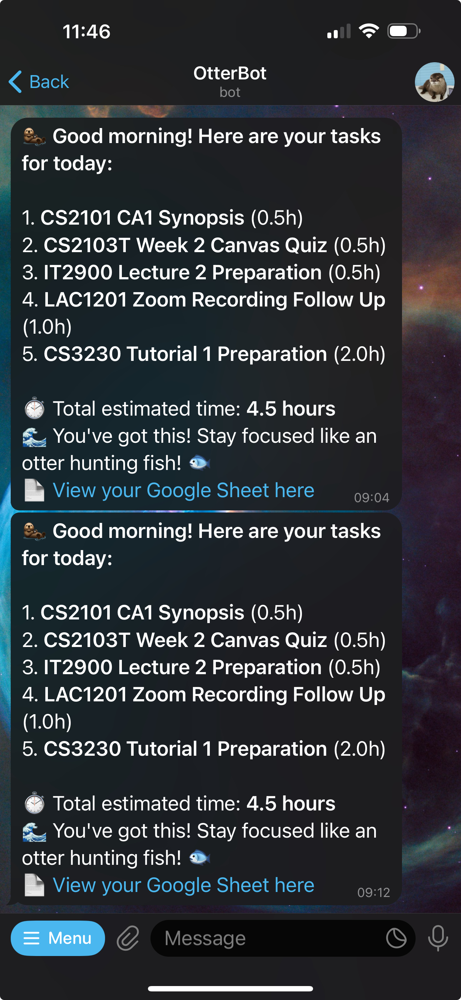

Personally, my effective productivity system is when I wake up and I know what I need to do that day. During university,
with an overwhelming number of courses and assignments, I often found **task management** difficult to manage and track.
So I thought, why not build some tools that can tell me immediately in the morning what I need to do today? I can add
tasks to the pool with the specified date, and then don't need to worry about missing out since it would be
automatically shown to me in the morning. This is how **OtterBot** was born. <!-- truncate -->

<figure>

<figcaption>

The GitHub repository for forking to make your own bot is available [here](https://github.com/oadultradeepfield/otterbot)

</figcaption>

</figure>

> **Note (effective 27 Oct):** The bot workflow was changed to run every 30 minutes. The previous _"magic minute"_ workaround to avoid scheduler conflicts is no longer used. The bot still sends the daily tasks message, but it now checks Google Sheets every 30 minutes and will resend if tasks change. A hashed copy of each sent message is saved and used to verify whether a resend is needed.

## Why Telegram Bot?

When deciding on what kind of product or platform to build, I usually think about how I want to use it the most. It
should be **low friction** both in development and usage. I think I use Telegram a lot, it is where I text all my
friends, and likely something I am checking in the morning just like emails or other notifications. Additionally, I had
never built one before, so I thought it would be a good learning opportunity, and might be inspiring for other projects
in the future as well.

### [@BotFather](https://telegram.me/BotFather)

Well, building a Telegram bot is not that hard. You just need to create a new bot
via [@BotFather](https://telegram.me/BotFather) and get the **token**, which is essentially the API key that you will
use for your code to communicate with the server. To send messages, you just need to have the **Chat ID** of the user or
group you want to message to. In my case, I am building a bot for myself, so I just need to know my chat ID, which can
be done in multiple ways (you can check this online).

### Programming Language Choice

Deciding on a programming language is sometimes difficult, but in this case, I think **Python** is the best choice since
it's really straightforward to build and deploy. Note that we also have Google Sheets integration in the upcoming
section, which Python excels at, since it's good for scraping tasks. Also, I don't need to worry about performance or
concurrency, so Python is a good choice for this project.

> Python also has a really good library for Telegram Bot, [python-telegram-bot](https://python-telegram-bot.org/), which can be convenient for building **interactive bots**. You may want to explore this for further development.

## Google Sheets Integration

Recently, I have been using lots of **Google Cloud Services** like Firebase, so I think it's not that difficult to set
things up. I can use Google Sheets as a database for this project, since it's easy to use and I can just use the API to
read and write data. The bot will read the tasks from Google Sheets and send messages to the user in the morning.

Google Sheets is good to access on any device, and the data is somewhat structured, so I can easily add new tasks and
manage them without worrying too much about the data structure. Below is an example of how I use Google Sheets in this
project.

<figure>

<figcaption>

Simple Google Sheets example. I only store the information I want to know. This is easily customizable.

</figcaption>

</figure>

## GitHub Actions

I found this to be the most fun and interesting part of the project. I realized not long ago that I don’t actually need
to set up hosting services or anything similar, since I can simply use **GitHub Actions** to run the bot every day at 8
AM. This is both convenient and cost-effective. The caveat is that it’s not very reliable (and also not interactive,
since it only spins up at specific times and then shuts down).

> GitHub Actions can sometimes be triggered **well after 8 AM if GitHub’s servers are busy at that time**. However, for the purpose of this project, it works well enough. _Saving time and deployment costs is the main goal here, and that’s truly a blessing!_

However, to mitigate this issue, I found a small trick. Although it’s not perfectly reliable, it’s still better than
nothing.

> You can schedule actions at a **random minute**, for example `"9 0 * * *"`, which runs at 00:09 AM UTC (08:09 AM
> Singapore time). This helps avoid peak times when the servers are likely to be busier.

At the end of the day, this is what I got. Or more accurately, at the beginning of the day :)

<figure>

<figcaption>

Example of the Telegram bot interface and the daily morning message (some messages were manually triggered here).

</figcaption>
</figure>
