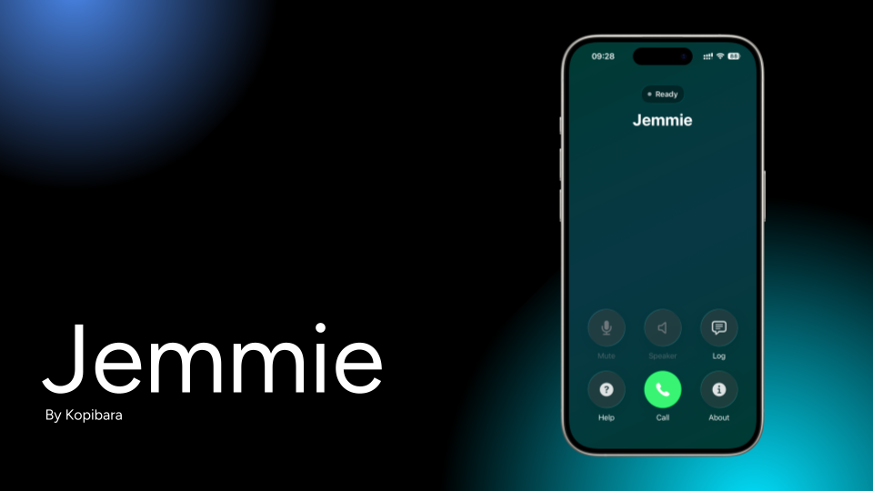
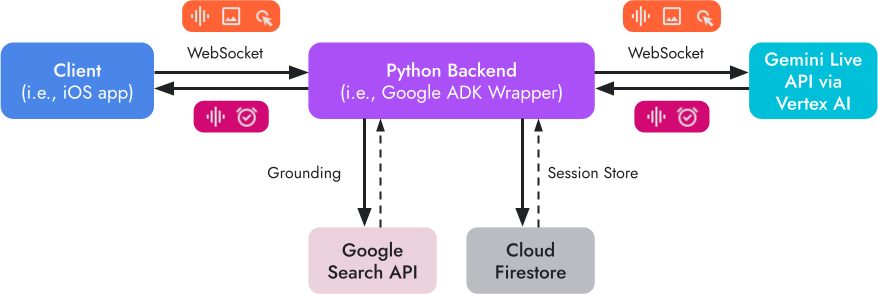

## The Problem with AI in Public

Have you ever tried to use Gemini or ChatGPT while walking on the street? It is quite awkward. You either look like you are staring at a text box, completely out of touch with the real world, or you look like you are on a mission to press a push-to-talk button on a walkie-talkie.

These are not just minor issues to be solved. They are major issues that prevent the full integration of AI into our everyday lives. We have the technology, but we do not have the interaction model right. We are making ourselves adapt to the technology instead of making the technology adapt to us.

This brings me to the concept of **invisible computing**, which is "hidden yet present." The concept is to use technology in a way that feels as natural as having a conversation with a friend walking alongside you.

## Jemmie: A Different Approach

Our project, Jemmie, is a direct response to the challenges, built specifically to participate in the Gemini Live Agent Challenge. It's a simple concept, but it has a profound impact:

- **Native Phone Call Integration**: Jemmie just works, integrating seamlessly into iOS CallKit. You won't stand out.
- **Smooth, Natural Speech**: Thanks to ultra-low latency, you can interrupt a sentence as naturally as a real conversation. No stiff, robotic silences.
- **Hands-Free Convenience**: Pop on your AirPods, and you're free to move about. No screens, no buttons – just the agent waiting for you when you need it.

<figure>



<figcaption>

Jemmie in action – a real-time voice agent that feels like a natural conversation.

</figcaption>

</figure>

> It's not about building a more intelligent agent – it's about building a more intuitive interface to the intelligent agent we already have. We have the brains – we just need to make it invisible.

## Architecture Overview

The system runs on **WebSocket** for real-time bidirectional communication between an iOS client and a Python backend.

<figure>



<figcaption>

WebSocket architecture showing the flow between iOS client, Python backend, and Google Cloud services (Gemini Live API, Firestore).

</figcaption>

</figure>

Message formats are simple: most messages use JSON format and carry a `type` and a `payload`. Audio is an exception and uses binary frames sent using `websocket.send_bytes()`. This bypasses the base64 encoding and decoding.

This is important when we consider that when we're having a voice conversation, every millisecond is important.

Having outlined the basic architecture, the question is: how do you build a system that scales and grows? That's what we'll explore next.

## Extensibility Through Actions and Events

The main concept of Jemmie is extensibility. The concept is to make the system improve with new capabilities without the need to make large-scale architectural changes. To achieve this, we have made a clean split between the client's requests for actions and the server's responses with events.

### Client Actions

Client actions are the operations a user can start from their device. At the moment, the operations a user can start are sending a test message back (echo), sharing your GPS location, and adjusting the volume.

The system uses a registry-based architecture, where every action handler is inside `src/actions/client/` and is registered with a decorator.

```python
@register_client_action("ACTION_TYPE")
class MyActionHandler(ClientActionHandler):
    def execute(self, payload: dict) -> None:
        # Handle the action
        pass
```

Every handler extends `ClientActionHandler` and must have an implementation of the `execute()` method. It is optional for the handler to provide a context template, `context_template`, to add context to the agent's knowledge base.

The process is straightforward: a client action is sent over the WebSocket to the `FrameEngine`, which uses the `ActionPipeline` to deliver it to the correct `ClientActionHandler`, and the result is queued for the Gemini agent to process. Simple, right?

### Server Events

On the other hand, server events refer to the messages that the agent is able to send to the client. This ranges from simple text and audio playback to more complex operations such as performing a web search, using a timer, and asking for permission to use the camera.

Events are structured as `OutboundFrame` objects:

```python
class OutboundFrame(BaseModel):
    type: str  # Event type
    payload: dict  # Event-specific data
    session_id: str  # Session identifier
    ts: int  # Timestamp (auto-generated)
```

> The important point to note is that the server events are given as a tool to the Gemini agent to make use of. This provides the LLM with the opportunity to make decisions on when to execute actions such as opening a URL or setting a reminder, thus giving the agent autonomy in how it interacts with the user's device.

## Data Models

The schema layer remains deliberately lightweight. The core models are defined in `src/schema/frames.py`:

- **ClientFrame**: the base model for client actions, with a `type` and a `payload`
- **ImageFrame**: the model for the image data, which includes the raw bytes and the mime-type
- **RawAudioFrame**: the model for the audio data, which includes the pcm bytes and a sample rate from 8000 to 48000 Hz

Sessions are persisted with a `SessionDocument` in `src/schema/session.py`, which includes the `device_id`, `session_id`, the current `state`, and `agent_context` to ensure the conversation remains coherent.

## Key Architecture Patterns

Looking back at all these architecture decisions, a few patterns stood out that we found particularly useful.

### Registry Pattern

The Registry Pattern is used to register action and events using decorators when modules import. In other words, when you need to add a new capability to a system, you simply need to add a new handler class and decorate it. The system will automatically recognize and route to it.

### Pipeline Architecture

Separating audio and action streams is a good thing. Audio goes through a streaming-optimized pipeline, and action goes through a separate pipeline that's optimized for validation and routing.

### Queue-Based Communication

The various parts of the system communicate using async queues. The `live_request_queue`, `outbound_queue`, and `content_queue` are all used as a buffer between different parts of the system. They allow each part to function independently without conflicting with other parts.

### ADK Integration

The ADK is integrated using a tool called `QueueBridge`, which bridges ADK's `LiveRequestQueue` to our internal queues. This layer of indirection ensures that voice agent implementation is not tightly coupled to LLM implementation.

## Closing Thoughts

That is the end of what we wanted to say on the subject of the project. The construction of Jemmie has taught us the real challenge of voice AI is not the AI technology, it is everything around it—latency requirements, interruption logic, session management, and above all, making it all seem seamless and natural.

The architecture we have outlined is by no means the only way to achieve the desired outcome. There are edge cases to be addressed, events to be added, and the constant pressure to reduce latency even further. But the patterns we have outlined have been consistently effective building blocks.

> If there is one lesson to be learned, it is the importance of **extensibility**. Extensibility is something you should build into your system, not something you add later. The use of the decorator pattern for the registry, the distinction between actions and events, has allowed new capabilities to be added with a few lines of code.

The dream of invisible computing is still just a dream. Projects like Jemmie are helping to make it a reality—experimenting to find out what it takes to make AI technology seem less like something you use, more like something you just use when you need it.

Thanks for your time. If you are curious to see the code, the project was built as part of the Gemini Live Agent Challenge using Google's ADK with Vertex AI on Google Cloud. The code is available on GitHub: [frontend](https://github.com/Spchdt/Jemmie) and [backend](https://github.com/oadultradeepfield/jemmie-backend).
